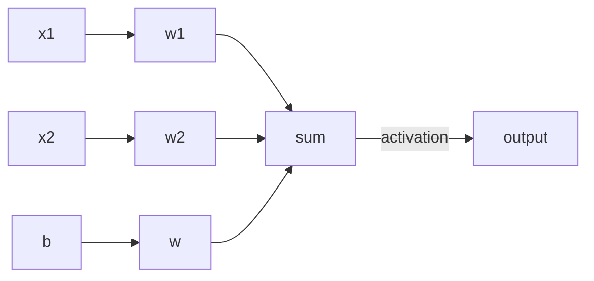
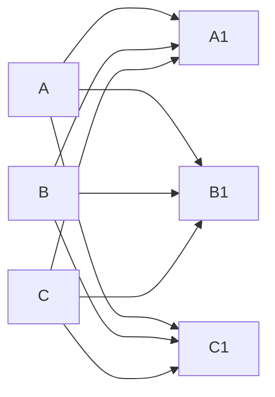

# Collaborative Document day 1

2022-09-26 Introduction to Deep Learning.

Welcome to The Workshop Collaborative Document.

This Document is synchronized as you type, so that everyone viewing this page sees the same text. This allows you to collaborate seamlessly on documents.

----------------------------------------------------------------------------


## 👮Code of Conduct

Participants are expected to follow these guidelines:
* Use welcoming and inclusive language.
* Be respectful of different viewpoints and experiences.
* Gracefully accept constructive criticism.
* Focus on what is best for the community.
* Show courtesy and respect towards other community members.
 
## ⚖️ License

All content is publicly available under the Creative Commons Attribution License: [creativecommons.org/licenses/by/4.0/](https://creativecommons.org/licenses/by/4.0/).

## 🙋Getting help

To ask a question, just raise your hand.

If you need help from a helper, place an **orange** post-it note on your laptop lid. A helper will come to assist you as soon as possible.

## 🖥 Workshop website

[Link to workshop website](


s://esciencecenter-digital-skills.github.io/2022-09-26-ds-dl-intro)

🛠 Setup: 
[link](https://esciencecenter-digital-skills.github.io/2022-09-26-ds-dl-intro/#setup)

Download files:
[weather dataset prediction csv](https://zenodo.org/record/5071376/files/weather_prediction_dataset_light.csv?download=1).

## 👩‍🏫👩‍💻🎓 Instructors

Dafne van Kuppevelt, Sven van der Burg

## 🧑‍🙋 Helpers

Pranav Chandramouli, Laura Ootes, Suvayu Ali

## 👩‍💻👩‍💼👨‍🔬🧑‍🔬🧑‍🚀🧙‍♂️🔧 Roll Call
Name/ pronouns (optional) / job, role / social media (twitter, github, ...) / background or interests (optional) / city
What is your favourite breakfast?
(Removed)


## 🗓️ Agenda
| Time | Topic |
|--:|:---|
| 9:30 | 	Welcome and icebreaker |
| 9:45 | Introduction to Deep Learning |
| 10:30 | Coffee break |
| 10:40 | Introduction to Deep Learning |
| 11:30 | Break |
| 11:40 | Classification by a Neural Network using Keras |
| 12:30 | Lunch Break |
| 13:30 | Classification by a Neural Network using Keras |
| 14:30 | Break |
| 14:40 | Classification by a Neural Network using Keras |
| 15:30 | Break |
| 15:40 | Classification by a Neural Network using Keras |
| 16:15 | Wrap-up |
| 16:30 | END |

## 🏢 Location logistics
* Coffee and toilets are in the hallway, just outside of the classroom.
* If you leave the building, 
  be sure to be accompanied by someone from the escience center to let you back in through the groundfloor door
* For access to this floor you might need to ring the doorbell so someone can let you in
* In case of an emergency, you can exit our floor using the main staircase.
  Or follow green light signs at the ceiling to the emergency staircase.
* **Wifi**: Eduroam should work. Otherwise use the 'matrixbuilding' network, password should be printed out and available somewhere in the room.

## 🔧 Exercises

### Exercise 1: calculate for one neuron
- Input: (0, 0.5, 1)
- Weights: (-1, -0.5, 0.5)
- Bias:
- Activation function: *relu*

      f(x) = max(0, x)

*Note:* You can use whatever you like: pen & paper, Python, Excel, ...

Answer: $f(b*w_b + \sum_ix_i*w_i)$

### Exercise 2: What applications do you know of Deep Learning in your field?

* segregating different intracellular compartments
* Predicting stock market prices
* Airfoil shape optimisation
* Short term precipitation forecasting from radar images (AI buienradar) [https://rainguru.tudelft.nl](https://rainguru.tudelft.nl)
* Identification of objects in the built enviroment (water bodies, buildings)
* predicting user demographics from social media text / images
* estimating socio-economic status of areas from satelite imagery
* Detection and Phase Picking of seismic events
* Classifications of Volcanic Events
* Detecting the nutrient needs of plants
* Identifying ice floes
* MonoCam for detecting people using phones while driving [https://reitsma.io/blog/aap](https://reitsma.io/blog/aap)
* Detecting suspicous things on pictures on phones like weapons and drugs etc
* Using deep learning to classify point cloud (from LiDAR), identifying what object is in point cloud.
* Predict the number of students dropping out for the next academic year.
* Identify stars within a certain star cluster.
* Tumor segmentation
* Indoor Air Quality prediction


### Exercise 3: which of the following problems are appropriate to solve with a DNN
Which of the following would you apply Deep Learning to?
1. Recognising whether or not a picture contains a bird.
2. Calculating the median and interquartile range of a dataset.
3. Identifying MRI images of a rare disease when only one or two example images available for training.
4. Identifying people in pictures after being trained only on cats and dogs.
5. Translating English into French.


#### Exercise 4: Deep Learning workflow

Think about a problem you'd like to use Deep Learning to solve.
1. What do you want a Deep Learning system to be able to tell you?
2. What data inputs and outputs will you have?
3. Do you think you'll need to train the network or will a pre-trained network be suitable?
4. What data do you have to train with? What preparation will your data need? Consider both the data you are going to predict/classify from and the data you'll use to train the network.

- Building inspections using drone images. Inputs would be images collected by drone, capturing buildings that may have damages. Outputs would be segmentations of damages of windows/doors/roof. Since the drone images have specific charateristics (high-resolution/variuos angles), we do need to train the network based on our own data. The trainning data would be annotated images where damages of a building have been segmented. We also need to include large sample size for each different damage types.
- Optimal design for ventilation system. Input: potential location for supply and exhaust. Output: floor plan. Need to train network. Simulations of different scenarios.
- Classify cell division errors into accurate or 1 of ~4 error types. Input = microscopy movies of dividing cells; output = multi-class classification. There are some pretrained networks doing similar things, but source code is missing/badly annotate/not maintained and they are not doing the same task. Have manually annotated microscopy movies. 
- Bias correction of weather and/or climate models. Input: model data. Output: in training: observations, operational: bias corrected forecast. If there are enough historical forecast+observation pairs, no pre-training needed. We have to pair observations with forecasts at that time and location. We have to match units of the observations and the forecasts. We have to clean observational data from measurement errors. 
- segmenting images to identify the number of seeds that germinated.
- recognising voices in speach data. Inputs would be wav files they will be converted to several wave features on which a model can be trained. Output would be wave features as well. No pre trained model and due to legal restrictions only possible on single investigations. But taking snippets of data will give enough samples for input.
- We would like to design a DL system for predicting communication style in online social media. We aim to use annotated textual data from online communication sources (such as whatsapp or instagram DMs) as an input. Each text corpus will be annotated with a certain communication style label (coming from literature in communication sciences). The output of the model would be a predicted communication style (classification problem). There are some pretrained NLP models available, such as BERT to be used for this problem. 
- predicting diagnosis of mental health problems starting from time-series data.
- link prediction in a person's network based on individuals' attributes. Our idea is to be able to predict i) if two people are connected based on ther profile described by a combination of age, income, educaiton level, location of residence, migrant generation, ethnic group and so on, and if yes ii) in which social context they are connected (family, classmates, colleagues, etc.). Data inputs: data attributes of a target population. Data output: probabiliy of a link existing for each social context. No pre-trained neural network available. Data for training: set of N people with their attributes and 0/1 as a training output to indicate if a link exists.
- Prediction of number of first year students dropping out per academic year. 1) The number of credit points each student would obtain. 2) inputs: student exam results, personal details (study program, backgrounds etc.) 3) Need to train the network. 4) Traing data: students from previous years. 


#### Exercise 5: Penguin Dataset

Inspect the penguins dataset.
1. What are the different features called in the dataframe?
2. Are the target classes of the dataset stored as numbers or strings?
3. How many samples does this dataset have?

#### Exercise 6: Pairplot

Take a look at the pairplot we created. Consider the following questions:

- Is there any class that is easily distinguishable from the others?
- Which combination of attributes shows the best separation for all 3 class labels at once?

#### Exercise 7: Training and Test sets

Take a look at the training and test set we created.
- How many samples do the training and test sets have?
- Are the classes in the training set well balanced?


#### Exercise 8: Create the neural network

With the code snippets above, we defined a Keras model with 1 hidden layer with 10 neurons and an output layer with 3 neurons.

- How many parameters does the resulting model have?
- What happens to the number of parameters if we increase or decrease the number of neurons in the hidden layer?


#### Exercise 9: The Training Curve
Looking at the training curve we have just made.

- How does the training progress?
- Does the training loss increase or decrease?
- Does it change fast or slowly?
- Is the graph look very jittery?
- Do you think the resulting trained network will work well on the test set?

#### Exercise 10: Confusion Matrix
Measure the performance of the neural network you trained and
visualize a confusion matrix.

Did the neural network perform well on the test set?
Did you expect this from the training loss you saw?
What could we do to improve the performance?

## 🧠 Collaborative Notes

#### What to expect?
- Build enough intuition about Deep Neural Networks (DNN) to start implementing yourself
- Deal with practical aspects rather than theoretical aspects

### What are neural networks?
- Inspired by a biological brain
- Basic units are also called neurons
- Every neuron takes several inputs and a bias term, which are weighted, which are combined with an activation function
- A NN consists of layers of neurons; all layers beside the input/output layers are known as hidden layers



Let's explore a bit with [Tensorflow Playground](https://playground.tensorflow.org)

#### Deep vs shallow neural networks
- Deep Neural Networks have lots of hidden layers of different kinds
- A shallow network has fewer layers

#### What kind of problems do DNNs typically solve better
- Pattern recognition: 
- Image segmentation
- Language translation
- Generating synthetic data
    - It is also possible to generate data from different kinds of input
    - text -> image, or image -> text

#### When is a DNN not a good idea?
- Where you are constrained by data (keywords: data sparsity)
- Tasks that require you to provide an explanation (keywords: explainability)
- Classify things that are not similar to the training data (keywords: out of distribution)

#### Typical Deep Learning workflow
- Formulate the problem clearly
- Identify inputs/outputs
- Prepare data
- Choose pre-trained / build a new architecture from scratch
- Choose loss function / optimizer
- Train the model
- Perform a prediction/classification
- Measure performance
- Tune hyperparameters

### Classify penguins using `keras`
- Problem formulation: predict penguin species using attributes
- Identify inputs/outputs:
    - input: different features (explore the dataset to find out)
    - output: penguin species

```python=
import seaborn as sns
penguins = sns.load_dataset('penguins')

penguins.head()
```
| | species|	island|	bill_length_mm|	bill_depth_mm|	flipper_length_mm|	body_mass_g|	sex|
|---|--|--|--|--|--|--|--|
|0|	Adelie|	Torgersen|	39.1|	18.7|	181.0|	3750.0|	Male|
|1|	Adelie|	Torgersen|	39.5|	17.4|	186.0|	3800.0|	Female|
|2|	Adelie|	Torgersen|	40.3|	18.0|	195.0|	3250.0|	Female|
|3|	Adelie|	Torgersen|	NaN|	NaN|	NaN|	NaN|	NaN|
|4|	Adelie|	Torgersen|	36.7|	19.3|	193.0|	3450.0|	Female|

You can get summary statistics with:
```python=5
penguins.describe()
```
You can find the species with:
```python=6
penguins["species"].unique()
# array(['Adelie', 'Chinstrap', 'Gentoo'], dtype=object)
```

#### Visualise & explore the dataset
Let's explore the dataset with a seaborn pairplot
```python=
sns.pairplot(penguins, hue="species")
```


#### Prepare the data
Fix the type of the "species" column:
```python=
penguins["species"] = penguins["species"].astype("category")
```
Drop columns with missing values
```python=
# Drop two columns and the rows that have NaN values in them
penguins_filtered = penguins.drop(columns=['island', 'sex']).dropna()

# Extract columns corresponding to features
penguins_features = penguins_filtered.drop(columns=['species'])
```

##### Using One Hot Encoding to prepare categorical data
If we encode categories with numbers, ML algorithms can misread them as an ordered feature when there is no such semantics.  So we use one hot encoding instead, which means we create a separate feature for each category, and set them to 1 or 0.

| row | species |
|--|--|
|1 | Adelie |
|2 | Adelie |
|3 | Chinstrap |
|4 | Gentoo |

For example the above table could be encoded as
| row | Adelie | Chinstrap | Gentoo |
|--|--|--|--|
|1 | 1 |0 |0 |
|2 | 1 |0 |0 |
|3 | 0 |1 |0 |
|4 | 0 |0 |1 |

```python=
import pandas as pd

target = pd.get_dummies(penguins_filtered['species'])
target.head() # print out the top 5 to see what it looks like.
```

#### Split the data set
``` python=
from sklearn.model_selection import train_test_split
X_train, X_test, y_train, y_test = train_test_split(penguins_features,target,
                                                    test_size=0.2,
                                                    random_state=0,
                                                    shuffle=True,
                                                    stratify=target)
```

```python=
# Number of samples in training and test set 
len(X_train), len(X_test)
```

```python=
# Show how the classes are balanced 
y_train.sum() # shows total number of samples per class
```

#### Build an architecture from scratch of choose a pretrained model
```python=
from tensorflow import keras
```
To ensure that we all get the same results, lets set the same [seed](https://en.wikipedia.org/wiki/Random_seed):
```python=2
from numpy.random import seed
seed(1)
from tensorflow.random import set_seed
set_seed(2)
```

We will define the different layers in our network
```python=6
inputs = keras.Input(shape=X_train.shape[1])
```

We will create a hidden layer and connect input layer.
There are different types of layers. We will use a 'dense' layer, which is a . A dense layer means that all neurons in the hidden layer are connected to all inputsrons of the previous layer (in this case the input). This is also known as a fully-connected layer.



```python=7
# defined a Keras model with 1 hidden layer with 10 
# neurons that uses the relu function as activation function
hidden_layer = keras.layers.Dense(10, activation="relu")(inputs)
```

Next we define the output layer (again a dense, fully connected, later) and connect the hidden layer to it:
```python=8
# Define the output layer with 3 neurons and a softmax activation function
output_layer = keras.layers.Dense(3, activation='softmax')(hidden_layer)
```

```python=10
model = keras.Model(inputs=inputs, outputs=output_layer)
```

```python=11
# Show the definitions of the created model and count the number of parameters
model.summary()
```

#### Choose a loss function and optimize it
A loss function will tell us how 'good' the output prediction is that our model determines. You want the value of the loss function to decrease as training continues (indicating that the results are more often correct).
The optimizer makes sure that the weights are changed in the direction that optimizes the loss.
```python=13
model.compile(optimizer='adam', 
               loss=keras.losses.CategoricalCrossentropy())
```

#### Train the model
An epoch is one iteration through all our training data. We iterate multiple times trough the training data so that the model can learn from it's mistakes and in that way we guide the model to decrease the loss funtction, and hence predict the correct answer more often. 
```python=15
history = model.fit(X_train, y_train, epochs=100)
```
You can also set the batch size in the fitting process, to pass parts of the data (batches) throught the model. During one epoch, the model will iterate through all batches. Right now we are using the default batch size.

```python=16
# Plot the loss against the 
sns.lineplot(x=history.epoch, y=history.history["loss"])
```


```python=18
y_pred = model.predict(X_test)
```

```python=19
prediction = pd.DataFrame(y_pred, columns=target.columns)
```

```python=20
predicted_species = prediction.idxmax(axis="columns")
predicted_species
```

### Plot a confusion matrix
```python=
from sklearn.metrics import confusion_matrix

true_species = y_test.idxmax(axis="columns")

matrix = confusion_matrix(true_species, predicted_species)

# Convert to a pandas dataframe
confusion_df = pd.DataFrame(matrix, index=y_test.columns.values, columns=y_test.columns.values)

# Set the names of the x and y axis, this helps with the readability of the heatmap.
confusion_df.index.name = 'True Label'
confusion_df.columns.name = 'Predicted Label'

sns.heatmap(confusion_df, annot=True)
```
We can try many things to improve the performance from here. One of the first things we can try is to balance the dataset better. Other options include: changing the network architecture or changing the training parameters


#### Save and share the model
```python=15
# Creates a folder with several files that together contain the details of you trained model (parameters; weights and biases, and the architecture)
model.save('your_cool_model')
```

```python=16
# Load you saved model
pretrained_model = keras.models.load_model('your_cool_model')
```

To use the loaded pretrained model on data X_test:
```python=18
# use the pretrained model here
y_pretrained_pred = pretrained_model.predict(X_test)
pretrained_prediction = pd.DataFrame(y_pretrained_pred, columns=target.columns.values)

# idxmax will select the column for each row with the highest value
pretrained_predicted_species = pretrained_prediction.idxmax(axis="columns")
print(pretrained_predicted_species)
```

## 📚 Resources
- Interesting project for explainable AI (XAI) with links to methods/research in XAI, [DIANNA](https://github.com/dianna-ai/dianna)
- [The difference between validation data and test data](https://machinelearningmastery.com/difference-test-validation-datasets/)
- [Underfitting and overfitting](https://machinelearningmastery.com/learning-curves-for-diagnosing-machine-learning-model-performance/)
- [Unbalanced data](https://towardsdatascience.com/handling-imbalanced-datasets-in-deep-learning-f48407a0e758)
- [Unbalanced data in Keras](https://www.tensorflow.org/tutorials/structured_data/imbalanced_data)
- [Tensorflow Playground, for visualizing neural networks](http://playground.tensorflow.org/#activation=tanh&batchSize=10&dataset=circle&regDataset=reg-plane&learningRate=0.03&regularizationRate=0&noise=0&networkShape=4,2&seed=0.45454&showTestData=false&discretize=false&percTrainData=50&x=true&y=true&xTimesY=false&xSquared=false&ySquared=false&cosX=false&sinX=false&cosY=false&sinY=false&collectStats=false&problem=classification&initZero=false&hideText=false)

### Code for plotting a confusion matrix
```python=
from sklearn.metrics import confusion_matrix

true_species = y_test.idxmax(axis="columns")

matrix = confusion_matrix(true_species, predicted_species)

# Convert to a pandas dataframe
confusion_df = pd.DataFrame(matrix, index=y_test.columns.values, columns=y_test.columns.values)

# Set the names of the x and y axis, this helps with the readability of the heatmap.
confusion_df.index.name = 'True Label'
confusion_df.columns.name = 'Predicted Label'

sns.heatmap(confusion_df, annot=True)
```